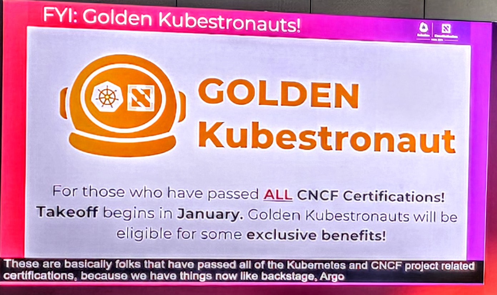

# The Golden Kubestronaut Preparation
A Github Repo for those pursuing Golden Kubestronaut Title.
> [!CAUTION] 
> The Golden Kubestronaut Program represents the ultimate recognition for cloud-native professionals. While it HASN'T BEEN officially launched yet, its anticipated rollout underscores the CNCF's commitment to fostering excellence within the community.

## What is the GOLDEN Kubestronaut Program?

 - 

### Firstly, What is a Kubestronaut?
A Kubestronaut is a title awarded to individuals who have completed 5 certifications (KCNA, KCSA, CKA, CKAD, CKS) which demonstrates their exceptional expertise in cloud-native technologies, particularly Kubernetes and related tools within the Cloud Native Computing Foundation (CNCF) landscape. This program is designed to recognize professionals who consistently strive to elevate their skills and contribute to the cloud-native community.

Kubestronauts are not just experts—they are trailblazers in the world of Kubernetes and cloud-native systems, showcasing their commitment through certifications, contributions, and advocacy for best practices.

### What is the Golden Kubestronaut Program?
The Golden Kubestronaut Program takes the recognition of cloud-native mastery to the next level. A Golden Kubestronaut is a distinguished Kubestronaut who has achieved the pinnacle of certification excellence by earning all 13 CNCF certifications and the Linux Foundation Certified System Administrator (LFCS) certification.

Unlike the standard Kubestronaut program, which may require periodic renewals, the Golden Kubestronaut title is a one-time, permanent achievement. Once awarded, this designation becomes a lifetime recognition of your expertise.

Certifications Required to Become a Golden Kubestronaut
Here are the certifications you need to earn this prestigious title:

### ALL CERTIFICATIONS:
- **Linux Foundation Certified System Administrator** (LFCS) - ([Prep](./1-LFCS/README.md))
- **Kubernetes and Cloud-Native Associate** (KCNA)
- **Kubernetes and Cloud Security Associate** (KCSA)
- **Certified Kubernetes Administrator** (CKA)
- **Certified Kubernetes Application Developer** (CKAD)
- **Certified Kubernetes Security Specialist** (CKS)
- **Prometheus Certified Associate** (PCA)
- **OpenTelemetry Certified Associate** (OTCA)
- **Istio Certified Associate** (ICA)
- **Kyverno Certified Associate** (KCA)
- **Certified Cilium Assosiate** (CCA)
- **Certified GitOps Associate** (CGOA)
- **Certified Argo Project Associate** (CAPA)
- **Certified Backstage Associate** (CBA)

### Benefits of Becoming a Golden Kubestronaut

Achieving Golden Kubestronaut status comes with exclusive perks that recognize your dedication to the cloud-native ecosystem:

- Swag Rewards:
    - Receive unique branded items like a Golden Kubestronaut Backpack or a signature cape as a badge of honor.
- OneThrive Subscription:
    - Complimentary subscription to OneThrive as long as you remain a Kubestronaut.
- Certification Discounts:
    - Enjoy 60% off on future CNCF certification exams.
- KubeCon Discounts: 
    - Get 50% off your registration for KubeCon, the flagship event for cloud-native enthusiasts.
- Free KCD Ticket: 
    - Receive one free ticket to a Kubernetes Community Days (KCD) event every year.